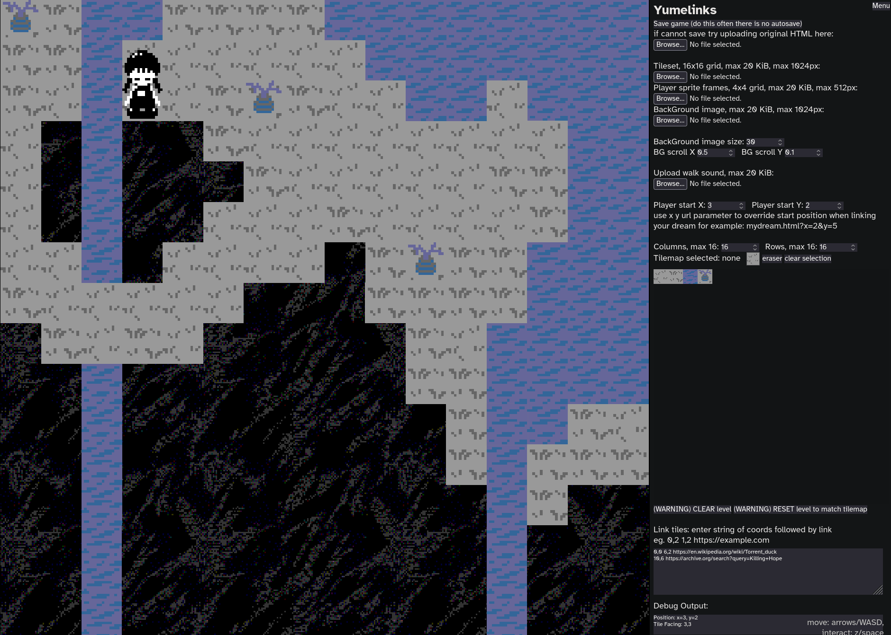

# yumelinks 
a dream room stored in a single html document

this tool lets you make small (<100KiB) dream sites in the style of yume nikki, visitors can interact with them by navigating a character around into links that can tie to other dreams or flow off into the wider internet, ideal for weird personal sites or neocities mazes

## uploading assets into html file dataurl embed:
all uploaded files must be under 20KiB, you can find many free compression tools online

#### player spritesheet:
- png, jpeg
- max size 512x512
- 4x4 animation sprites:
```
    foot in air
    |     feet on ground
    |     |     other foot in air
    v     v     v
 +1-----2-----3-----4----
1|up    up    up    blank
2|right right right blank
3|down  down  down  blank
4|left  left  left  blank
```
#### tileset:
- png, jpeg
- max size 1024x1024
- 16x16 tile sheet
  
#### walk sound:
- mp3, wav, ogg
- aim for less than a second long

#### TODO IMPLIMENT: alternatively you can add url to assets stored in folders or online

## putting it on your site
**if you place it within an iframe on your page and some functions do not work try adding these sandbox rules to the iframe**
`sandbox="allow-scripts allow-popups allow-downloads""`
- `allow-scripts` is essential
- `allow-popups` is required for opening links on link tiles
- `allow-downloads` is required for saving from inside the iframe

**you can link to the page with x and y url parameters to start the player at a specific position**
this can be used to have different entry points into your dream

## editing the code
**editing above the "EDITOR" section can be used to make more simple changes to the css and gameplay**
editing below this point is a mess and may drive you to madness (please help)

**please try your best to keep accessability in mind when making any edits, some good accessability practices:**
- clearly label any interactable elements within them, in a separate `<label for=>`or with an `aria-label=`
- try to make as many elements as possible keyboard navigable, or selectable with tools like [vimium](https://github.com/philc/vimium)
- if you add rapidly changing or flashing imagery please give clear epilepsy warnings when linking to your dream

**thank you for checking out this project**
it's fully CC0 public domain but if you do make anything with it i'd love to see
